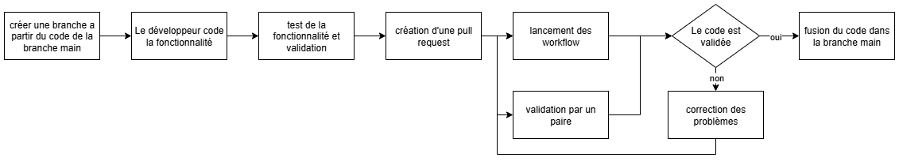
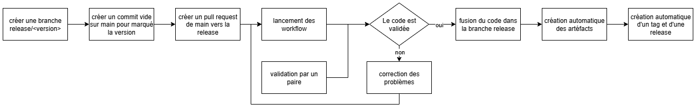
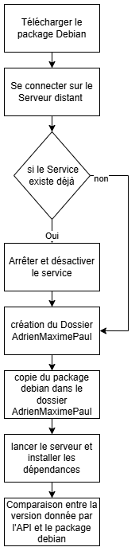

# Rapport, retour d'expérience

## Le projet: Simeis

Simeis est un jeu par API (inspiré de SpaceTraders), dont le but est de faire fructifier votre
empire économique dans toute la galaxie.

### Le principe

Dans ce jeu, vous devez gérer votre flotte de vaisseaux miniers. Pour cela, vous pouvez acheter des vaisseaux et leur affecter un équipage. Ensuite, vous pouvez les envoyer sur différentes planètes afin de récupérer les ressources disponibles. Après quoi, elles peuvent être transférées à la station pour pouvoir les vendre. Vous pouvez également améliorer votre station ainsi que vos vaisseaux ou membre d'équipage afin de produire plus, stocker plus et vendre plus pour optimiser votre empire. Plus de détails sont disponibles dans le [manuel du jeu](./manual.pdf).

### Les contraintes

Le serveur gère une partie en multijoueur ce qui inclue les contraintes suivantes :

- Le serveur doit être capable de gérer plusieurs joueurs en même temps.
- Le serveur doit être capable de gérer d'importantes quantités de requêtes.
- Le serveur doit être capable de gérer des parties de plusieurs heures.
- Le serveur se doit de ne pas avantager certains joueurs par rapport à d'autres.

Le serveur doit également permettre de lancer une partie rapidement.

### technologie

Le projet est développé en Rust et build avec Cargo.
Pour lancé le serveur, il suffit de lancer la commande `cargo run --release` à la racine du projet.
Cargo se chargeras de télécharger les dépendances ainsi que de compiler le projet.
Si vous souhaitez lancer le serveur en mode debug, il suffit de lancer la commande `cargo run`.
Vous pouvez également build le projet avec la commande `cargo build --release` pour générer un binaire dans le dossier `target/release/simeis-server`.
La variante debug est également disponible via la commande `cargo build`, le binaire sera alors dans le dossier `target/debug/simeis-server`.

### Architecture

L'API est composée de deux dossiers principaux :

- `simeis-data` : contient les modèles de données ainsi que les fonctions métiers.
- `simeis-api` : contient les routes de l'API ainsi que la configuration

```tree
simeis-data
 ├── src
 │    ├── galaxy
 │    │    ├── planet.rs
 │    │    ├── scan.rs
 │    │    └── station.rs
 │    ├── ship
 │    │    ├── cargo.rs
 │    │    ├── module.rs
 │    │    ├── navigation.rs
 │    │    ├── resource.rs
 │    │    ├── shipstats.rs
 │    │    └── upgrade.rs
 │    ├── crew.rs
 │    ├── error.rs
 │    ├── galaxy.rs
 │    ├── game.rs
 │    ├── lib.rs
 │    ├── market.rs
 │    ├── player.rs
 │    ├── ship.rs
 │    ├── syslog.rs
 │    └── tests.rs
 └── Cargo.toml
simeis-api
 ├── src
 │    ├── api.rs
 │    └── main.rs
 └── Cargo.toml
Cargo.toml
```

### Le workflow de travail

La branche `main` est la branche de développement du projet. C'est sur cette branche que les développeurs travaillent et ajoutent de nouvelles fonctionnalités. Pour chaque changement à apporter, les développeurs créent une nouvelle branche de travail à partir de `main`. Cette branche de travail est nommée en fonction de la fonctionnalité ou du bug à corriger, par exemple `feature/ajout-nouvelle-fonctionnalite` ou `bug/correction-bug`. De cette manière, les développeurs peuvent travailler sur plusieurs fonctionnalités en parallèle sans interférer les uns avec les autres. De plus, on peut facilement connaître la nature du changement sans se référer à l'issue associée. Une fois le développement terminé, le développeur crée une pull request vers la branche `main`. Cette pull request est ensuite revue par les autres développeurs du projet (au moins 1 personne dont le 'code owner'). De plus des 'jobs github' sont lancé ce qui nous permet d'effectué des vérifications sur la qualité du code qui a été ajouter. Si la pull request est approuvée et si les 'jobs github' ont été exécuté avec succès, elle est fusionnée dans la branche `main`. Si des modifications sont nécessaires, elles sont demandées au développeur et la pull request est mise à jour en conséquence.



Une fois tous les développements terminés, une nouvelle version du projet peut être créée. Pour cela, on crée une nouvelle branche `release/` à partir de `main`. Un commit vide est ajouté sur la branche `main` pour marquer la fin de la version et permettre de créer une nouvelle pull request vers `release/`. De nouveaux 'jobs github' sont lancés pour effectuer des vérifications supplémentaires sur la qualité du code et la sécurité des dépendances. Ces jobs sont bien plus long car ils poussent plus loin les vérifications, ainsi pour gagner du temps dans les développements, ils ne sont pas lancés à chaque pull request mais uniquement sur les branches de release. Une fois la pull request approuvée et les jobs validés, la pull request est fusionnée dans la branche `release/`. Enfin, un workflow de release est lancé pour créer une nouvelle release du projet. Ce workflow va générer un binaire, un package debian et une image docker du projet. Il va ensuite créer une release sur GitHub avec les artefacts générés.



Cette release ne peut plus recevoir de nouvelles fonctionnalités, cependant elle peut recevoir des correctifs. Pour cela, on créer une nouvelle branche `bug/` à partir de la branche `main`. Une fois le correctif apporté, on crée une pull request vers `main` et on ajoute les labels `propagate:release/` pour chaque release corrigée par ce correctif. Une fois la pull request approuvée, un jobs va automatiquement créer une nouvelle pull request vers chaque branche de release pour propager le correctif. De cette manière, on s'assure que les correctifs sont bien propagés sur toutes les versions du projet. La brache `main` ainsi que les branches `bug/` sont les seules branches qui peuvent être déversées dans une branche de release. Cela permet de s'assurer que les branches de release ne contiennent que des correctifs et pas de nouvelles fonctionnalités. De plus, cela permet de s'assurer que les branches de release sont stables et ne contiennent pas de bugs.

### Mise en cache  

Pour optimiser les performances des workflows, un cache est mis en place pour les dépendances et les builds :

- **Les dépendances cargo**  
- **Le build CMake**  
- **Le build cargo**  
- **Les dépendances python**  

Le cache est mis en place pour éviter de télécharger les dépendances à chaque exécution du workflow. Cela permet de gagner du temps et d'optimiser les performances des workflows. Le cache est gérée directement par GitHub Actions. Son fonctionnement est simple :

- On vérifie si le cache existe et si c'est le cas, on le restaure.
- Si le cache n'existe pas, on télécharge les dépendances ou on build le projet et on les ajoute au cache.
- On exécute la suite du workflow avec les dépendances ou le build récupéré du cache.

le cache est identifié par un hash. Celui-ci est calculé à partir des fichiers de configuration en fonction de la partie mis en cache (les packages manager pour les dépendances, le code source pour les builds). Ainsi, si les fichiers de configurations sont modifiés par le développement, le hash se retrouve modifié et le cache est considéré invalide. Ainsi, il sera recréé pour permettre l'ajout de ces modifications dans celui-ci.


Pour optimiser le développement du projet, une CI est mise en place avec GitHub Actions.
Cette CI va permettre de lancer des vérifications sur le code à chaque pull request, mais aussi de mettre à jour les dépendances du projet automatiquement.
De plus, elle va permettre de lancer des tests sur le projet pour s'assurer que les fonctionnalités sont bien fonctionnelles et qu'aucune régression n'est introduite par les nouvelles fonctionnalités.

- `dependabot` :  ce worklow est exécuté tous les jours à minuit. Il ne contient qu'un job. Celui-ci va venir mettre à jour les dépendances du projet. Si des dépendances ont été mises à jour, une pull request est automatiquement créée pour ajouter les nouvelles dépendances au projet. Elle n'est pas automatiquement fusionnée pour qu'un développeur effectue des vérifications sur les nouvelles dépendances afin de s'assurer qu'elles sont toujours sûres et qu'elles ne causent pas de bug dans le projet.


- `dev-workflow` :  dev-workflow est exécuté à chaque pull request sur la branche `main`. Il ne possède qu'un seul job. Celui-ci va lancer l'ensemble des tests du projet pour s'assurer que les nouvelles fonctionnalités ne causent pas de régression ainsi que les nouvelles fonctionnalités sont bien fonctionnelles.


- `matrice-check` : ce workflow est exécuté à chaque pull request sur la branche `main` et que la branche source commence par `feature/`. Ce workflow ce lance pour les systèmes d'exploitation Linux, MacOS, Windows ainsi que pour les versions de rust 1.75.0, 1.80.0, 1.85.0, 1.88.0. Il va ensuite, pour chacun d'entre eux, vérifié que le code compile correctement. Cela nous permet de nous assurer que le code est compatible avec plusieurs systèmes d'exploitation et versions de Rust.


- `PR-workflow` :  ce workflow est exécuté lors d'une pull request sur les branches `main` ou `release/`. Il est composé de plusieurs jobs qui vont venir vérifier la qualité du code ainsi que si les TODO et les FIXME sont bien liés à une issue.

- **Vérification Rust/Cargo** :  
  - Vérifie que le code peut compiler et si la syntaxe du code est correcte grâce a `cargo check`
  
    

  - Vérifie que le code respecte les conventions de formatage (saut de ligne, espace) grâce a `cargo fmt--check`  

    

  - Vérification du linting, il s'agit de la structure avancée du code, et de sa qualité. On y retrouve les vérifications de :
    - les variables inutilisées
    - les fonctions inutilisées
    - les imports inutilisés
    - les variables non initialisées
    - le nom des variables et des fonctions
    - les types de variables
    ces vérification sont permises grace a l'outil `cargo clippy`.

    

- **Vérification CMake** :
  Cmake est un outil de build qui permet de générer des fichiers de configuration pour différents système de build.

  - On vérifie que le code peut compiler et que la syntaxe du code est correcte avec le build de Cmake.

    

  - On vérifie que le projet peut être construit et lancé avec Cmake.

    

  - On vérifie que le manuel de l'API est bien généré avec Cmake.

    

  - On vérifie que les tests sont bien lancés avec CMake.

    

- **Vérification des TODO** :  

  - Verifie, que les TODO et les FIXME sont bien lié, a une issue. Les TODO et FIXME sont des commentaires dans le code qui permettent de signaler des tâches à accomplir ou des bugs à corriger. Il est important de s'assurer que ces TODO et FIXME sont bien liés à une issue pour éviter de laisser des tâches non accomplies ou des bugs non corrigés. Pour cela, on utilise un script qui va parcourir l'ensemble du code et vérifier que chaque TODO et FIXME est bien lié à une issue. Si ce n'est pas le cas, on renvoie un message d'erreur.

    

### Préparation des releases  

`release-workflow` : release-workflow est exécuté lors d'une pull request sur `release/*`.  
Il va lancer plusieurs Jobs :  

- **heavy-testing** :  
  Ce job va lancer les tests sur le projet pour vérifier que toutes les fonctionnalités sont bien fonctionnelles. De plus les "proprety-based tests" sont lancé en bien plus grand nombre afin de couvrir un maximum de cas possibles.


- **cargo-audit** :  
  Ce jobs va venir vérifier que les dépendances du projet ne contiennent pas de vulnérabilités connues. Pour cela, on utilise la commande `cargo audit` qui va analyser les dépendances du projet et renvoyer un rapport des vulnérabilités trouvées. Si une quelconque vulnérabilité est trouvée (même si elle est mineure), nous renvoyons une erreur. Cela nous permet de nous assurer que le projet ne contient pas de dépendances vulnérables.


- **check-dep** :  
  Ici, on va vérifier que toutes les dépendances sont utilisées dans le projet. Pour cela, on utilise un script bash qui récupère l'ensemble des dépendances déclarer dans le fichier `Cargo.toml` a la racine du projet. Puis pour chaque dépendance trouvée, on va parcourir l'ensemble du projet à la recherche d'un import de cette dépendance. Si la dépendance n'est pas utilisée, on renvoie un message d'erreur.


- **functional-tests** :  
  Ce job va exécuter les tests fonctionnels du projet, c'est-à-dire des scénarios utilisateur.
  Actuellement, il y a trois scénarios de test créé :
  - tester si un nouveau joueur peut démarrer une partie. Cela consiste à créer un nouveau joueur, acheter un vaisseau et acheter un équipage complet ainsi qu'un module d'excavation (Miner ou Gaz Sucker).
  - tester le fonctionnement du trajet. Il va vérifier que la position change lorsque le vaisseau se déplace.  
  - tester le fonctionnement de l'amélioration d'un membre de l'équipage.

  Grace a ces tests, on s'assure que les fonctionnalités principales du jeu sont fonctionnelles.

  
- **coverage** :  
  Ce job va venir verifier que la couverture de code est supérieure à 50 %. C'est-à-dire que les tests exécute au moins 50 % du code du projet. Cela nous permet de nous assurer que des tests sont bien rédigés pour chaque fonctionnalité du projet. Pour permettre cela, on utilise une librairie Cargo `tarpaulin` qui va venir effectuer une analyse de la couverture du code et renvoyer un rapport de couverture. Ainsi, nous pouvons l'utiliser pour appliquer une vérification que la couverture est bien supérieure à 50 %. Si la couverture est inférieure à 50 %, on ajoute un label `not enough tests` à la pull request pour signaler le problème.

  
- **verificationSource** :  
  Dans le workflow de release, la nouvelle release ne doit cette base que sur la branche `main`. Une fois la release créée, seul des correctifs peuvent y être apportés. Pour s'assurer de cela, on vérifie que la branche source de la pull request commence par `bug/` ou s'il s'agit de la branche `main`. SI ce n'est pas le cas, on ferme automatiquement la pull request.

  
  
- `propagate-workflow` : lorsqu'une pull request est validé et fusionnée, si la branche source commence par `bug/`. Ce workflow va récupérer les labels au format `propagate:release/`. Pour chaque label trouvé, il va créer une nouvelle pull request vers la branche de release correspondante afin de propager les changements apportés par le correctif.

  

### Déploiement des releases

`auto-release` : ce workflow est exécuté lorsqu'on push sur une branche qui commence par `release/`. Ce workflow a pour devoir de générer 3 artefacts (un binaire, un package debian et une image docker) et de créer une release sur GitHub. Le workflow est divisé en plusieurs jobs :

- **upload-binaries** :  
  Ce job va build le projet afin de générer un fichier binaire du serveur. Il va ensuite l'uploader dans les artefacts du workflow.

  

- **package-deb** :
  Ce job va récupérer le binaire généré par le job précédent et va créer un package debian pour pouvoir exécuter le serveur sur Linux. Il va ensuite exporter le package dans les artefacts du workflow.

  

- **upload-docker-image** :
  Ce job va récupérer le binaire généré par le job précédent et va créer une image docker pour pouvoir exécuter le serveur dans un conteneur. Il va ensuite exporter l'image dans les artefacts du workflow.

  

- **upload-docker-image-on-dockerhub** :
  Ce job va récupérer le binaire généré par le job précédent et va créer une image docker pour pouvoir exécuter le serveur dans un conteneur. Il va ensuite tester si l'image docker se lance correctement. Enfin, il va exporter l'image dans docker hub.

  

- **create-release** :
  Ce job va récupérer l'ensemble des artefacts générés par les jobs précédents. Il va ensuite générer un tag ainsi qu'une release sur github dans lequel il va y ajouter les artefacts.

  

L'ensemble des jobs ne se lance pas en même temps, car certains dépendent d'autres. En effet les jobs `package-deb`, `upload-docker-image` et `upload-docker-image-on-dockerhub` dépendent du job `upload-binaries` pour pouvoir récupérer le binaire généré. Le job `create-release` dépend de l'ensemble des autres jobs pour pouvoir récupérer les artefacts générés.


## Déploiement

Dans un premier temps, nous récupérons la version de la release, qui servira à identifier la bonne version du package d'installation. Après avoir téléchargé ce package, nous créons un fichier contenant notre clé SSH. Cette clé nous permet ensuite d'établir une connexion avec le serveur distant.

Une fois connectés, nous vérifions si une instance du serveur est déjà en cours d'exécution. Si oui, nous l'arrêtons et la désactivons afin de garantir que seule la nouvelle version sera active. Ensuite, nous redémarrons le serveur pour nous assurer que la bonne version est bien lancée.

Nous transférons ensuite le package sur le serveur distant et installation la nouvelle version sur le serveur avec ses dépendances. Pour finir, nous vérifions que la version retournée par l’API de la route/version correspond bien au numéro de version fourni par le package Debian.



## Retour d'expérience

Ce projet de CI/CD était très complet et ludique. L'utilisation d'un jeu comme base du projet est intéressante et nous fait gagner du temps aux lieux de nous refaire faire un projet.
L'ordre des tp était aussi très bien pensé, il nous a permis de découvrir les différentes étapes de la CI/CD de manière progressive. Nous avons commencé par la mise en place d'une CI simple, puis nous avons ajouté des vérifications de qualité du code, des tests fonctionnels et enfin la mise en place d'un déploiement automatisé.
Nous avons également découvert l'utilisation de GitHub Actions pour automatiser les workflows de CI/CD.
Les nombreux travaux réalisés ont permis de découvrir de manière large le domaine de la CI/CD.
Cependant, d'avantage de temps aurait été appréciable afin de pouvoir davantage approfondir chacun des sujets abordés notamment la partie CD et de pouvoir faire toutes les parties au lieu de séparer les exercices.
Enfin le choix de nous refaire faire certaines fonctionnalités étaient une bonne idée pour nous permettre de bien comprendre leurs utilisations et leurs limites et de nous faire découvrir la documentation de github et autre.

## Léxiques

### Git  

Git est un logiciel de gestion de code. Il permet de suivre les modifications apportées au code, de collaborer avec d'autres développeurs et gérer les versions des projets. Il utilise un système de branches pour permettre aux développeurs de travailler sur des fonctionnalités ou des corrections sans affecter le code principal.

- **Pull Request** : une pull request (PR) est une demande de fusion d'une branche dans une autre. Elle permet de proposer des modifications et de les faire examiner avant de les intégrer dans le code principal.  
- **Workflow** : un workflow est un ensemble de tâches automatisées qui s'exécutent.
- **Job** : un job est une tâche individuelle dans un workflow. Ils peuvent être exécutés de manière dépendante les unes des autres ou en parallèle avec d'autres jobs.
- **Release** : Une release est une version stable et figée du projet.
- **Artefact** : un artefact est un produit fini téléchargeable. Il peut s'agir d'un binaire, d'un package, d'une bibliotheque, une source, etc.
- **Tag** : un tag est une référence à un commit spécifique dans l'historique du projet. Il s'agit d'une version fix dans le temps.
- **Branche** : une branche est une version parallèle du code. Elle permet de travailler sur des fonctionnalités ou des corrections sans affecter le code principal.
- **Commit** : un commit est une modification apportée au code. Il contient un message décrivant les changements effectués et un identifiant unique.
- **Issue** : une issue est un ticket de suivi des problèmes ou des fonctionnalités à implémenter dans le projet. Elle permet de suivre les tâches à accomplir.
- **Merge** : une fusion (merge) est l'action de combiner les modifications d'une branche dans une autre. Cela permet d'intégrer les changements effectués dans une branche de développement dans la branche principale du projet.

### API

Une API est une interface qui permet à deux applications ou services de communiquer entre eux. Elle définit les règles et les formats d'échange de données. Dans le cas de Simeis, l'API permet aux clients de communiquer avec le serveur, à travers des URL, pour récupérer des informations sur le jeu, envoyer des actions, etc.

### Compilation

La compilation est l'opération qui permet de traduire le code source d'un logiciel en un programme exécutable dans un format binaire, le « langage machine. »

### Build

Le build est le processus de transformation du code source en un programme exécutable. Il comprend la compilation, l'assemblage des dépendances et la création d'un fichier binaire prêt à être exécuté.

### CI/CD

- **CI** : la CI (intégration Continue) consiste à automatiser divers processus tels que la compilation, le lancement des tests, la vérification de la qualité du code, etc.
- **CD** : la CD (Déploiement Continu) est le processus de déploiement automatique des modifications validées dans divers environnements tel que la production. Cela permet de livrer rapidement les nouvelles fonctionnalités et corrections aux utilisateurs.

### Déploiement

- **SSH** : SSH est une méthode permettant d'envoyer en toute sécurité des commandes à un ordinateur sur un réseau non sécurisé.

- **Distribution Linux** : une distribution Linux est un système d'exploitation prêt à être installé, conçue à partir d'un noyau Linux.

- **DEBIAN** : Debian est une distribution Linux, composée presque exclusivement de logiciels libres.

- **Conteneur** : un conteneur est un environnement d'exécution contenant tous les composants nécessaires, tels que le code, les dépendances et les bibliothèques, nécessaires pour exécuter le code de l'application sans utiliser les dépendances de la machine hôte.

- **DOCKER** : le logiciel Docker est une technologie de conteneurisation qui permet la création et l'utilisation de conteneurs Linux.
