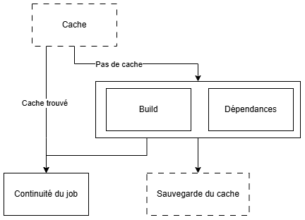

# Rapport, retour d'expérience

## Le projet: Simeis

Simeis est un jeu par API (inspiré de SpaceTraders), dont le but est de faire fructifier votre
empire économique dans toute la galaxie.

### Le principe

Dans ce jeu, vous devez gérer votre flotte de vaisseaux miniers. Pour cela, vous pouvez acheter des vaisseaux et leur affecter un équipage. Ensuite, vous pouvez les envoyer sur différentes planètes afin de récupérer les ressources disponibles. Après quoi, elles peuvent être transférées à la station pour pouvoir les vendre. Vous pouvez également améliorer votre station ainsi que vos vaisseaux ou membre d'équipage afin de produire plus, stocker plus et vendre plus pour optimiser votre empire. Plus de détails sont disponibles dans le [manuel du jeu](./manual.pdf).

### technologie

Le projet est développé en Rust et build avec Cargo.
Pour lancé le serveur, il suffit de lancer la commande `cargo run --release` à la racine du projet.
Cargo ce chargeras de télécharger les dépendances ainsi que de compiler le projet.
Si vous souhaitez lancer le serveur en mode debug, il suffit de lancer la commande `cargo run`.
Vous pouvez également build le projet avec la commande `cargo build --release` pour générer un binaire dans le dossier `target/release/simeis-server`.
La variante debug est également disponible via la commande `cargo build`, le binaire sera alors dans le dossier `target/debug/simeis-server`.

### Architecture

L'API est composer de deux dossiers principaux :
- `simeis-data` : contient les modèles de données ainsi que les fonctions métier.
- `simeis-api` : contient les routes de l'API ainsi que la configuration

```
├── simeis-data
│   ├── src
│   │   ├── galaxy
│   │   │   ├── planet.rs
│   │   │   ├── scan.rs
│   │   │   └── station.rs
│   │   ├── ship
│   │   │   ├── cargo.rs
│   │   │   ├── module.rs
│   │   │   ├── navigation.rs
│   │   │   ├── resource.rs
│   │   │   ├── shipstats.rs
│   │   │   └── upgrade.rs
│   │   ├── crew.rs
│   │   ├── error.rs
│   │   ├── galaxy.rs
│   │   ├── game.rs
│   │   ├── lib.rs
│   │   ├── market.rs
│   │   ├── player.rs
│   │   ├── ship.rs
│   │   ├── syslog.rs
│   │   └── tests.rs
│   └── Cargo.toml
├── simeis-api
│   ├── src
│   │   ├── api.rs
│   │   └── main.rs
│   └── Cargo.toml
└── Cargo.toml
```


## Travail des développeurs
### Mise en cache  
Pour optimiser les performances des workflows, un cache est mis en place pour les dependaces et les builds :    
- **Les dependances cargo**  
- **Le build CMake**  
- **Le build cargo**  
- **Les dependances python**  

Voilà un schema récapitulatif du fonctionnement du cache :




### Workflow développement
Pour optimiser la CI plusieurs workflows ont été mis en place :
- `dependabot` :  Le workflow dependabot permet de mettre à jour les dépendances du projet automatiquement, à minuit, tous les jours.  


- `dev-workflow` :  dev-workflow est executé à chaque pull request sur la branche `main`. Il va lancer tout les tests afin de verifier que le code ajouté sur `main` n'apporte pas de problemes au projet.
- `matrice-check` :  Lors d'une pull request sur `main`, si la branche source commence par `feature/`, ce workflow va tester si le projet fonctionne sur different systemes d'exploitation (Linux, MacOS, Windows) mais aussi sur differente version de Rust.
- `propagate-workflow` :  Lorsqu'une pull request est fermée, si elle a été fusionnée, que la branche source commence par `bug/` et que le label contient `propagate`, ce workflow va créer une nouvelle pull request sur chaque release afin de propager les changements sur toutes les versions du projet.
- `PR-workflow` :  Ce workflow est executé lors d'une pull request sur les branches `main` ou `release/*`. Il va lancer plusieurs verification sur le nouveau code :  

    **Verification Rust/Cargo** :  
    - Verifie que le code compile grace a `cargo check`
    - Verifie que le code respecte les conventions de formattage grace a `cargo fmt--check`
    - Verification supplementaire pour detecter les problemes grace a `cargo clippy`  
    
    **Verification CMake** :  
    - Verifie que le code peut build correctement grace a `cmake --build . --target check_code`  
    - Build le code grace a `cmake --build . --target build_simeis`  
    - Genere la documentation grace a `cmake --build . --target build_manual`  
    - Execute les tests grace a `cmake --build . --target run_tests`  
    - Nettoie les fichiers de build grace a `cmake --build . --target clean_dev`  
    
    **Verification des TODO** :  
    - Verifie que les TODO et les FIXME sont bien lié a une issue  


### Prépartion des releases  
`release-workflow` : release-workflow est executé lors d'une pull request sur `release/*`.  
Il va lancer plusieurs Jobs :  
- **heavy-testing** :  
  Ce job va lancer les tests sur le projet pour verifier que toute les fonctionnalitées sont bien fonctionnelles. De plus les "proprety-based tests" sont lancé en bien plusgrand nombre afin de couvrir un maximum de cas possibles.


- **cargo-audit** :  
  Ce jobs va venir verifier que les dépendances du projet ne contiennent pas de vulnérabilités connues. Pour cela on utilise la commande `cargo audit` qui va analyser les dépendances du projet et renvoyer un rapport des vulnérabilités trouvées. Si une quelconque vulnérabilité est trouvée (même si elle est mineure), nous renvoyons une erreur. Cela nous permet de nous assurer que le projet ne contient pas de dépendances vulnérables.


- **check-dep** :  
  Ici on va verifier que toutes les dépendances sont utilisées dans le projet. Pour cela on utilise un script bash qui récupère l'nessemble des dépendances déclarer dans lefichier `Cargo.toml` a la racine du projet. Puis pour chaque dépendance trouvée, on va parcourir l'enssemble du projet a la recherche d'un import de cette dépendance. Sila dépendance n'est pas utilisée, on renvoie un message d'erreur.


- **functional-tests** :  
  Ce job va executer les tests fonctionnels du projet c'est a dire des scenarios utilisateur.
  actuelement il y a trois scenarios de test créer :
  - tester si un nouveau joueur peut démarrer une partie. Cela consiste a créer un nouveau joueur, acheter un vaisseau et acheter un équipage complet ainsi qu'un module d'excavation (Miner ou Gaz Sucker).
  - tester le fonctionnement du trajet. Il va verifier que la postition change lorsque le vaisseau se déplace.  
  - tester le fonctionnement de l'amelioration d'un membre de l'équipage.

  Grace a ces tests, on s'assure que les fonctionnalités principales du jeu sont fonctionnelles.

  
- **coverage** :  
  Ce job va venir verifier que la couverture de code est supérieure à 50%. c'est à dire que les tests execute au moins 50% du code du projet. Cela nous permet de nous assurer que des tests sont bien rédigé pour chaque fonctionnalité du projet. Pour permettre cela, on utilise une librairie Cargo `tarpaulin` qui va venir effectuer une analyse de la couverture du code et renvoyer un rapport de couverture. Ainsi, nous pouvons l'utiliser pour apliquer une vérification que la couverture est bien supérieure à 50%. Si la couverture est inférieure à 50%, on ajoute un label `not enough tests` à la pull request pour signaler le problème.

  
- **verificationSource** :  
  Dans le workflow de release, la nouvelle release ne doit ce base que sur la branche `main`. Une fois la release créée, seul des correctifs peuvent y etre apportés. Pour s'assurer de cela, on verifie que la branche source de la pull request commence par `bug/` ou si il s'agit de la branche `main`. SI ce n'est pas le cas on ferme automatiquement la pull request.

  

### Déploiement des releases

`auto-release` : Ce workflow est executé lorsqu'on push sur une brache qui commance par `release/`. Ce workflow a pour devoir de générer 3 artefacts (un binaire, un package debian et une image docker) et de créer une release sur GitHub. Le workflow est divisé en plusieurs jobs :

- **upload-binaries** :  
  Ce job va build le projet afin de générer un fichier binaire du serveur. Il va ensuite l'uploader dans les artefacts du workflow.

  

- **package-deb** :
  Ce job va récupérer le binaire généré par le job précédent et va créer un package debian pour pouvoir exécuter le serveur sur Linux. Il va ensuite uploader le package dansles artefacts du workflow.

  

- **upload-docker-image** :
  Ce job va récupérer le binaire généré par le job précédent et va créer une image docker pour pouvoir exécuter le serveur dans un conteneur. Il va ensuite uploader l'imagedans les artefacts du workflow.

  

- **upload-docker-image-on-dockerhub** :
  Ce job va récupérer le binaire généré par le job précédent et va créer une image docker pour pouvoir exécuter le serveur dans un conteneur. Il va ensuite tester si l'imagedocker ce lance correctement. Enfin, il va uploader l'image dans docker hub.

  

- **create-release** :
  Ce job va récupérer l'enssemble des artefacts générés par les jobs précédents. Il va ensuite générer un tag ainsi qu'une release sur github dans le quel il va y ajouterles artefacts.

  

l'ensemble des jobs ne ce lance pas en même temps car certains dépendent d'autres. En effet les jobs `package-deb`, `upload-docker-image` et `upload-docker-image-on-dockerhub` dépendent du job `upload-binaries` pour pouvoir récupérer le binaire généré. Le job `create-release` dépend de l'ensemble des autres jobs pour pouvoir récupérer les artefacts générés.


## Lancement du projet
## Retour d'expérience