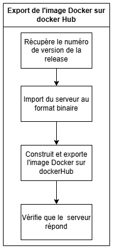

# Rapport, retour d'expérience

## Le projet: Simeis

Simeis est un jeu par API (inspiré de SpaceTraders), dont le but est de faire fructifier votre
empire économique dans toute la galaxie.

### Le principe

Dans ce jeu, vous devez gérer votre flotte de vaisseaux miniers. Pour cela, vous pouvez acheter des vaisseaux et leur affecter un équipage. Ensuite, vous pouvez les envoyer sur différentes planètes afin de récupérer les ressources disponibles. Après quoi, elles peuvent être transférées à la station pour pouvoir les vendre. Vous pouvez également améliorer votre station ainsi que vos vaisseaux ou membre d'équipage afin de produire plus, stocker plus et vendre plus pour optimiser votre empire. Plus de détails sont disponibles dans le [manuel du jeu](./manual.pdf).

### Les contraintes

Le serveur gère une partie en multijeur ce qui inclue les contraintes suivantes :

- Le serveur doit être capable de gérer plusieurs joueurs en même temps.
- Le serveur doit être capable de gérer d'importantes quantités de requetes.
- Le serveur doit être capable de gérer des parties de plusieurs heures.
- Le serveur ce doit de ne pas avantager certains joueurs par rapport à d'autres.

Le server doit également permettre de lancer une partie rapidement.

### technologie

Le projet est développé en Rust et build avec Cargo.
Pour lancé le serveur, il suffit de lancer la commande `cargo run --release` à la racine du projet.
Cargo ce chargeras de télécharger les dépendances ainsi que de compiler le projet.
Si vous souhaitez lancer le serveur en mode debug, il suffit de lancer la commande `cargo run`.
Vous pouvez également build le projet avec la commande `cargo build --release` pour générer un binaire dans le dossier `target/release/simeis-server`.
La variante debug est également disponible via la commande `cargo build`, le binaire sera alors dans le dossier `target/debug/simeis-server`.

### Architecture

L'API est composer de deux dossiers principaux :

- `simeis-data` : contient les modèles de données ainsi que les fonctions métier.
- `simeis-api` : contient les routes de l'API ainsi que la configuration

```tree
simeis-data
 ├── src
 │    ├── galaxy
 │    │    ├── planet.rs
 │    │    ├── scan.rs
 │    │    └── station.rs
 │    ├── ship
 │    │    ├── cargo.rs
 │    │    ├── module.rs
 │    │    ├── navigation.rs
 │    │    ├── resource.rs
 │    │    ├── shipstats.rs
 │    │    └── upgrade.rs
 │    ├── crew.rs
 │    ├── error.rs
 │    ├── galaxy.rs
 │    ├── game.rs
 │    ├── lib.rs
 │    ├── market.rs
 │    ├── player.rs
 │    ├── ship.rs
 │    ├── syslog.rs
 │    └── tests.rs
 └── Cargo.toml
simeis-api
 ├── src
 │    ├── api.rs
 │    └── main.rs
 └── Cargo.toml
Cargo.toml
```

### Le workflow de travail

La branche `main` est la branche de développement du projet. C'est sur cette branche que les développeurs travaillent et ajoutent de nouvelles fonctionnalités. Pour chaque changement a apporter, les développeurs créent une nouvelle branche de travail à partir de `main`. Cette branche de travail est nommée en fonction de la fonctionnalité ou du bug à corriger, par exemple `feature/ajout-nouvelle-fonctionnalite` ou `bug/correction-bug`. De cette manière, les développeurs peuvent travailler sur plusieurs fonctionnalités en parallèle sans interférer les uns avec les autres. De plus, on peut facilement connaitre la nature du changement sans ce référer à l'issue associée. Une fois le développement terminé, le développeur crée une pull request vers la branche `main`. Cette pull request est ensuite revue par les autres développeursdu projet (au moins 1 personne dont le 'code owner'). De plus des 'jobs github' sont lancé ce qui nous permet d'éffectué des vérifications sur la qualité du code qui a été ajouter. Si la pull request est approuvée et si les 'jobs github' ont été executé avec succès, elle est fusionnée dans la branche `main`. Si des modifications sont nécessaires, elles sont demandées au développeur et la pull request est mise à jour en conséquence. Une fois tous les développement terminés, une nouvelle version du projet peut etre créée. Pour cela, on crée une nouvelle branche `release/<version>` à partir de `main`. Un commit vide est ajouter sur la branche `main` pour marquer la fin de la version et permettre de créer une nouvelle pull request vers `release/<version>`. De nouveaux 'jobs github' sont lancés pour éffectuer des vérifications supplémentaires sur la qualité du code et la sécurité des dépendances. C'est jobs sont bien plus long car ils poussent plus loin les vérifications, ainsi pour gagné du temps dans les développements, ils ne sont pas lancés à chaque pull request mais uniquement sur les branches de release. Une fois la pull request approuvée et les jobs validées, la pull request est fusionnée dans la branche `release/<version>`. Enfin, un workflow de release est lancé pour créer une nouvelle release du projet. Ce workflow va générer un binaire, un package debian et une image docker du projet. Il va ensuite créer une release sur GitHub avec les artefacts générés. Cette release ne peut plus recevoir de nouvelles fonctionnalités, cepandent elle peut recevoir des correctifs. pour cela, on créer une nouvelle branche `bug/<nom-du-bug>` à partir de la branche `main`. Une fois le correctif apporté, on crée une pull request vers `main` et on ajoute les labels `propagate:release/<version>` pour chaque release corrigée par ce correctif. Une fois la pull request approuvée, un jobs va automatiquement créer une nouvelle pull request vers chaque branche de release pour propager le correctif. De cette manière, on s'assure que les correctifs sont bien propagés sur toutes les versions du projet. La brache `main` ainsi que les branches `bug/<nom-du-bug>` sont les seules branches qui peuvent être déversées dans une branche de release. Cela permet de s'assurer que les branches de release ne contiennent que des correctifs et pas de nouvelles fonctionnalités. De plus, cela permet de s'assurer que les branches de release sont stables et ne contiennent pas de bugs.

### Mise en cache  

Pour optimiser les performances des workflows, un cache est mis en place pour les dependaces et les builds :

- **Les dependances cargo**  
- **Le build CMake**  
- **Le build cargo**  
- **Les dependances python**  

Le cache est mis en place pour éviter de télécharger les dépendances à chaque exécution du workflow. Cela permet de gagner du temps et d'optimiser les performances des workflows. Le cache est géré directement par GitHub Actions. sont fonctionnement est simple :

- On vérifie si le cache existe et si c'est le cas, on le restaure.
- Si le cache n'existe pas, on télécharge les dépendances ou on build le projet et on les ajoute au cache.
- On execute la suite du workflow avec les dépendances ou le build récupéré du cache.

le cache est identifé par un hash. Celui ci est calculé à partir des fichiers de configuration en fonction de la partie mis en cache (les packages manager pour les dépendances, le code sources pour les builds). Ainsi, si les fichiers de configurations sont modifiés par le développement, le hash ce retrouve modifié et le cache est concidérer invalide. Ainsi, il sera recréé pour permettre l'ajoue de c'est modifications. dans celui-ci.


Pour optimiser le développement du projet, une CI est mise en place avec GitHub Actions.
Cette CI va permettre de lancer des vérifications sur le code à chaque pull request, mais aussi de mettre à jour les dépendances du projet automatiquement.
De plus, elle va permettre de lancer des tests sur le projet pour s'assurer que les fonctionnalités sont bien fonctionnelles et qu'aucune régression n'est introduite par les nouvelles fonctionnalités.

- `dependabot` :  Ce worklow est exécuté tous les jours a minuit. Il ne contient qu'un job. Celui-ci va venir mettre à jour les dépendances du projet. Si des dépendances ont été mises à jour, une pull request est automatiquement créée pour ajouter les nouvelles dépendances au projet. Elle n'est pas automatiquement fusionnée pour qu'un développeur effectue des vérifications sur les nouvelles dépendances afin de s'assurer qu'elles sont toujours sure et qu'elles ne causent pas de bug dans le projet.


- `dev-workflow` :  dev-workflow est executé à chaque pull request sur la branche `main`. Il ne possède qu'un seul job. Celui-ci va lancé l'ensemble des tests du projet pour s'assurer que les nouvelles fonctionnalités ne causent pas de régression ainsi que les nouvelles fonctionnalités sont bien fonctionnelles.


- `matrice-check` : Ce workflow est exécuté à chaque pull request sur la branche `main` et que la branche source commence par `feature/`. Ce workflow ce lance pour les système d'exploitation Linux, MacOS, Windows anisi que pour les version de rust 1.75.0, 1.80.0, 1.85.0, 1.88.0. Il va ensuite, pour chaqu'un d'entre eux, vérifié que le code compile correctement. Cela nous permet de nous assurer que le code est compatible avec plusieurs systèmes d'exploitation et versions de Rust.


- `PR-workflow` :  Ce workflow est executé lors d'une pull request sur les branches `main` ou `release/<version>`. Il est composer de plusieurs jobs qui vont venir vérifier la qualité du code ainsi que si les TODO et les FIXME sont bien liés à une issue.

- **Verification Rust/Cargo** :  
  - Verifie que le code peut compiler et si la syntaxe du code est correct grace a `cargo check`
  
    

  - Verifie que le code respecte les conventions de formattage (saut de ligne, espace) grace a `cargo fmt--check`  

    

  - Verification du linting, il s'agit de le structure avancé du code, et de sa qualité. On y retrouve les vérification de :
    - les variables inutilisées
    - les fonctions inutilisées
    - les imports inutilisés
    - les variables non initialisées
    - le nom des variables et des fonctions
    - les types de variables
  c'est vérification sont permises grace a l'outil `cargo clippy`.

    

- **Verification CMake** :
  Cmake est un outil de build qui permet de générer des fichiers de configuration pour différents système de build.

  - On vérifie que le code peut compiler et que la syntaxe du code est correct avec le build de Cmake.

    

  - On vérifie que le projet peut être construit et lancé avec Cmake.

    

  - On vérifie que le manuel de l'API est bien généré avec Cmake.

    

  - On vérifie que les tests sont bien lancés avec CMake.

    

- **Verification des TODO** :  

  - Verifie que les TODO et les FIXME sont bien lié a une issue. Les TODO et FIXME sont des commentaires dans le code qui permettent de signaler des tâches à accomplir ou des bugs à corriger. Il est important de s'assurer que ces TODO et FIXME sont bien liés à une issue pour éviter de laisser des tâches non accomplies ou des bugs non corrigés. Pour cela, on utilise un script qui va parcourir l'enssemble du code et vérifier que chaque TODO et FIXME est bien lié à une issue. Si ce n'est pas le cas, on renvoie un message d'erreur.

    

### Prépartion des releases  

`release-workflow` : release-workflow est executé lors d'une pull request sur `release/*`.  
Il va lancer plusieurs Jobs :  

- **heavy-testing** :  
  Ce job va lancer les tests sur le projet pour verifier que toute les fonctionnalitées sont bien fonctionnelles. De plus les "proprety-based tests" sont lancé en bien plusgrand nombre afin de couvrir un maximum de cas possibles.


- **cargo-audit** :  
  Ce jobs va venir verifier que les dépendances du projet ne contiennent pas de vulnérabilités connues. Pour cela on utilise la commande `cargo audit` qui va analyser les dépendances du projet et renvoyer un rapport des vulnérabilités trouvées. Si une quelconque vulnérabilité est trouvée (même si elle est mineure), nous renvoyons une erreur. Cela nous permet de nous assurer que le projet ne contient pas de dépendances vulnérables.


- **check-dep** :  
  Ici on va verifier que toutes les dépendances sont utilisées dans le projet. Pour cela on utilise un script bash qui récupère l'nessemble des dépendances déclarer dans lefichier `Cargo.toml` a la racine du projet. Puis pour chaque dépendance trouvée, on va parcourir l'enssemble du projet a la recherche d'un import de cette dépendance. Sila dépendance n'est pas utilisée, on renvoie un message d'erreur.


- **functional-tests** :  
  Ce job va executer les tests fonctionnels du projet c'est a dire des scenarios utilisateur.
  actuelement il y a trois scenarios de test créer :
  - tester si un nouveau joueur peut démarrer une partie. Cela consiste a créer un nouveau joueur, acheter un vaisseau et acheter un équipage complet ainsi qu'un module d'excavation (Miner ou Gaz Sucker).
  - tester le fonctionnement du trajet. Il va verifier que la postition change lorsque le vaisseau se déplace.  
  - tester le fonctionnement de l'amelioration d'un membre de l'équipage.

  Grace a ces tests, on s'assure que les fonctionnalités principales du jeu sont fonctionnelles.

  
- **coverage** :  
  Ce job va venir verifier que la couverture de code est supérieure à 50%. c'est à dire que les tests execute au moins 50% du code du projet. Cela nous permet de nous assurer que des tests sont bien rédigé pour chaque fonctionnalité du projet. Pour permettre cela, on utilise une librairie Cargo `tarpaulin` qui va venir effectuer une analyse de la couverture du code et renvoyer un rapport de couverture. Ainsi, nous pouvons l'utiliser pour apliquer une vérification que la couverture est bien supérieure à 50%. Si la couverture est inférieure à 50%, on ajoute un label `not enough tests` à la pull request pour signaler le problème.

  
- **verificationSource** :  
  Dans le workflow de release, la nouvelle release ne doit ce base que sur la branche `main`. Une fois la release créée, seul des correctifs peuvent y etre apportés. Pour s'assurer de cela, on verifie que la branche source de la pull request commence par `bug/` ou si il s'agit de la branche `main`. SI ce n'est pas le cas on ferme automatiquement la pull request.

  
  
- `propagate-workflow` : Lorsqu'une pull request est validé et fusionnée, si la branche source commence par `bug/`. Ce workflow va récupérer les labels au format `propagate:release/<version>`. Pour chaque label trouvé, il va créer une nouvelle pull request vers la branche de release correspondante afin de propager les changements apportés par le correctif.

  

### Déploiement des releases

`auto-release` : Ce workflow est executé lorsqu'on push sur une brache qui commance par `release/`. Ce workflow a pour devoir de générer 3 artefacts (un binaire, un package debian et une image docker) et de créer une release sur GitHub. Le workflow est divisé en plusieurs jobs :

- **upload-binaries** :  
  Ce job va build le projet afin de générer un fichier binaire du serveur. Il va ensuite l'uploader dans les artefacts du workflow.

  

- **package-deb** :
  Ce job va récupérer le binaire généré par le job précédent et va créer un package debian pour pouvoir exécuter le serveur sur Linux. Il va ensuite uploader le package dansles artefacts du workflow.

  

- **upload-docker-image** :
  Ce job va récupérer le binaire généré par le job précédent et va créer une image docker pour pouvoir exécuter le serveur dans un conteneur. Il va ensuite uploader l'imagedans les artefacts du workflow.

  

- **upload-docker-image-on-dockerhub** :
  Ce job va récupérer le binaire généré par le job précédent et va créer une image docker pour pouvoir exécuter le serveur dans un conteneur. Il va ensuite tester si l'imagedocker ce lance correctement. Enfin, il va uploader l'image dans docker hub.

  

- **create-release** :
  Ce job va récupérer l'enssemble des artefacts générés par les jobs précédents. Il va ensuite générer un tag ainsi qu'une release sur github dans le quel il va y ajouterles artefacts.

  

l'ensemble des jobs ne ce lance pas en même temps car certains dépendent d'autres. En effet les jobs `package-deb`, `upload-docker-image` et `upload-docker-image-on-dockerhub` dépendent du job `upload-binaries` pour pouvoir récupérer le binaire généré. Le job `create-release` dépend de l'ensemble des autres jobs pour pouvoir récupérer les artefacts générés.


## Retour d'expérience

